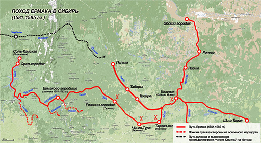

# ТЕМА
Сибирский поход Ермака — поход казачьего отряда Ермака на территорию Сибирского ханства (1581—1585), который положил начало русскому покорению Сибири.
***
# МАРШРУТ
Итак, по одни сведениям, в сентябре 1581 (по другим данным – летом 1582) Ермак отправился в военный поход. Это был именно военный поход, а не разбойничий набег. В состав его вооруженного формирования входили 540 собственных казачьих сил и 300 «ополченцев» от Строгановых. Рать тронулась  вверх по реке Чусовой на стругах. По некоторым сведениям, было всего 80 стругов, то есть примерно по 10 человек в каждом.
От Нижних Чусовских городков по руслу реки Чусовой отряд Ермака дошел:
- по одной версии до реки Серебряная, поднялся по ней. На руках перетащили струги до речки Журавлик, впадающую в р. Баранча – левый приток Тагила;
- по другой версии, Ермак с товарищами дошли до реки Межевая Утка, поднялись по ней и потом перевалили струги в речку Каменка, потом в Выю – тоже левый приток Тагила.
***
# МАТЕРИАЛЫ
*ссылка на карту json:*
[geojson.io](http://geojson.io/#id=gist:EkShakirova/43a00e2b789ec043aa32a06d2177800a&map=6/58.625/62.754)

*исходное изображение:*
